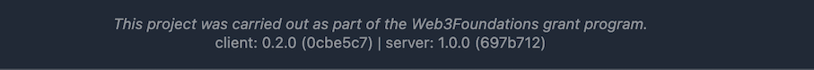
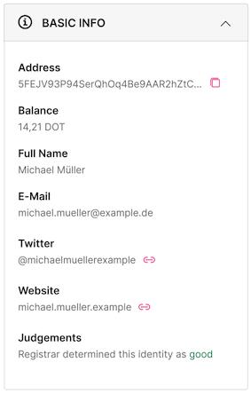

# SubIdentity Webapp

SubIdentity is a web application that can be used to search for identities on all substrate chains that implement the identity pallet.
See the [tutorial](./docs/Tutorial.md) for an explanation of how to use the SubIdentity webapp.

## Project setup

### Installs dependencies
```
npm install
```

### Compiles and hot-reloads for development
```
npm run serve
```

### Compiles and minifies for production
```
npm run build
```

### Runs your unit tests
Core functions are covered by unit tests to ensure functionality and robustness. To run the unit tests use:

```
npm run test
```

### Lints and fixes files

💡 Hint: Set up your IDE to automatically run that on save. Works in VS Code and IntelliJ.

```
npm run lint
```

## Data

### Npm package
SubIdentity Webapp by default uses the [SubIdentity npm package](https://www.npmjs.com/package/@npmjs_tdsoftware/subidentity) to search for identities on a given node. The easiest way is to download that package from npm `@npmjs_tdsoftware/subidentity`.
But if you want to extend the functionality you can download [the package source code](https://github.com/TDSoftware/subidentity-package), adjust it to your needs and use it with `npm link` locally.

### Backend
In order to get more detailed information about identities of a Substrate based chain, the webapp can be connected to the [SubIdentity backend](https://github.com/TDSoftware/subidentity-backend). For more information on how to run the backend, or it's features, read the [project's readme](https://github.com/TDSoftware/subidentity-backend/blob/main/readme.md) as only the connection to the web application is explained here.
If the backend is running, and you want to use the backend to fetch identities, follow these steps before running or building the web application:
    1. Duplicate the [.env.template](./.env.template) file and name it `.env`.
    2. Edit the value for `VUE_APP_API_URL` to match your backend URL. If you are running the backend locally, it might look like this: `VUE_APP_API_URL=http://localhost:5001`

Now if you run the web application now, it tries to reach the SubIdentity backend to get identities from there. If it is reachable at the specified URL, the selected chain implements the identity pallet, and the node is an archive node, the backend indexes the chain. For more information read the [project's readme](https://github.com/TDSoftware/subidentity-backend/blob/main/readme.md).
After a chain is indexed, the web application retrieves identities from there instead of using the npm package. If a chain is not indexed yet or the node is not an archive node, the npm package is used as a fallback to request identity information.

ℹ️ If a connection to the SubIdentity backend was established successfully, you can see the server version and git commit hash next to the client version and git commit hash in the footer of the application, as seen in the screenshot below.



## Views

The application has 3 main views:
- Search View - to search for identities
- List View - to display found identities
- Identity View - to display a selected identity

## Search View
### Chain Selection

By default, you can choose between Polkadot, Kusama and Westend to search for identities. It is possible to change the list of default chains by adding/removing them from the  `chains` list in  `./src/util/chains.ts ` before the web application is run. To do so, you need to add a chain with following properties:

```
        {
            key: "unique_key",
            name: "Name to display in Dropdown",
            address: "wss://ENDPOINT_URL"
        }
```

❗ You can only search identities on a substrate chain implementing the identity pallet. If you are not sure, if the node you want to use implements the identity pallet, you can use the `implementsIdentityPallet` feature from the [npm package](https://www.npmjs.com/package/@npmjs_tdsoftware/subidentity) to check.

## Identity View
The identity view is used to display detailed information of a selected identity. For more information see the [tutorial](./docs/Tutorial.md).

### Manage Plugins

Plugins like seen in following picture are used to display information.



The identity view can easily be extended with custom plugins to display various information as explained below. You can refer to `./src/components/partials/profile/plugins/BasicInfoPlugin.vue` as an example.

To add your own plugin create a vue file with a significant name in `./src/components/partials/profile/plugins/`. Use the Accordion component to place your content inside in order to add a plugin matching the Basic Plugin Design.
Import it into your plugin from `./src/components/common/Accordion.vue` and use it like:

```
<template>
    <Accordion>
        <template #title>YOUR TITLE HERE</template>
        <template #body>YOUR BODY CONTENT HERE</template>
    </Accordion>
</template>    
```
Then import the plugin into the `IdentityView.vue` and add it to the list of components as follows:
```
import BasicInfoPlugin from "@/components/partials/profile/plugins/BasicInfoPlugin.vue";
import YourPluginName from "@/components/partials/profile/plugins/YourPluginName.vue";

@Options({
    components: {
        //... all the components used in Identity View
        BasicInfoPlugin,
        YourPluginName
    }
})
```

Now you can use it like the basic info plugin in your identity view:
```
    <div v-if="loaded" class="plugins fade-in">
        <BasicInfoPlugin :identity="identity" />
        <YourPluginName />
    </div>
```
## Design
A high-fidelity, pixel perfect, responsive design can be found [here](https://www.figma.com/file/Rn8xSxi3flRBJ0Nf0GKWeK/SubIdentity-Public).

## License
Apache License 2.0
