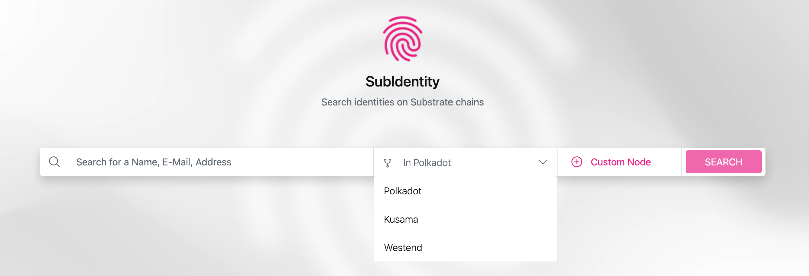
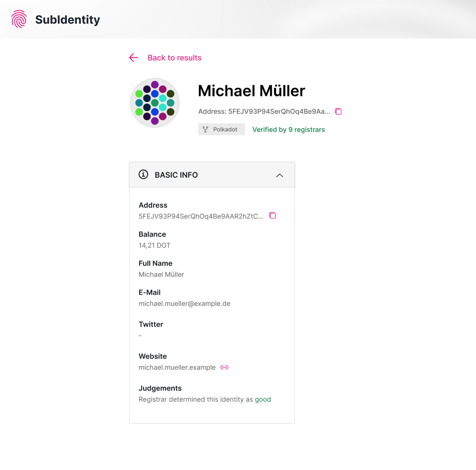

# SubIdentitiy
## Introduction
SubIdentity is a web application that can be used to search for identities on all substrate chains that implement the identity pallet. This document is giving an introduction on how to use SubIdentity webapp.

## Chain Selection

As seen in the picture above, by default you can choose between Polkadot, Kusama and Westend to search for identities. Select the chain you want to search identities on from the dropdown.

## Search Identities
After selecting a chain to search on, identities can be searched by address or any identity field. The search term must be entered in the [search box](#searchBar) seen in the screenshot above. Click the "SEARCH" button to start your search.

## View Results

After searching like described [previously](#searchIdentities), you will be redirected to a List View, which contains the results of your search. All identities on the selected chain, that fit the entered search term will be displayed.
If you click on a table row, you will be redirected to the users [Identity View](#identityView).

##  View Identity

In the Identity View, as seen in the screenshot above, the available details of a user are displayed. The identicon (round image in the top left of the view) displays an address as a unique icon and could therefore be used to recognize an identity. Information is displayed in separate plugins. Basic Information can be found in the Plugin with title "Basic Info".

ℹ️ If an information of the selected identity is missing, the field for this information will not be shown.
