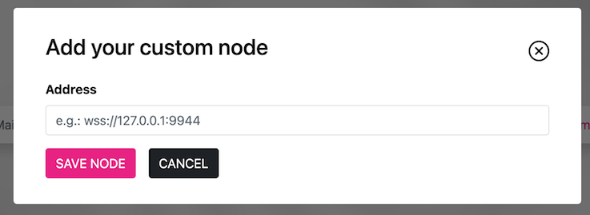
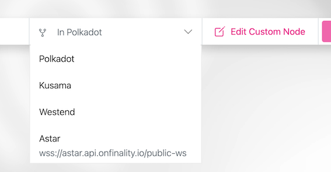
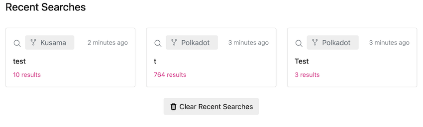

# SubIdentity
## Introduction
SubIdentity is a web application that can be used to search for identities on all substrate chains that implement the identity pallet. This document is giving an introduction on how to use SubIdentity webapp.

## Chain Selection

As seen in the picture above, by default you can choose between Polkadot, Kusama and Westend to search for identities. Alternatively, you can add a custom node, as described in [in the next chapter](#customNode) Select the chain you want to search identities on from the dropdown menu.

ℹ️ If a chain doesn't implement the identity pallet an error will be displayed when the chain is chosen from the dropdown.

##  Custom node

To add a custom node, you need to click on the "+ Custom Node" button in the search bar, as seen in the screenshot above. The following modal will open:

Please enter the address for your custom node in the input field and click "SAVE NODE". If the node is available, it will be added to the dropdown menu as shown in following screenshot and identities can be searched on it.

To edit the node address or connect to a different node, click on the "Edit Custom Node" button. In the modal that opens, adjust the address as desired and click the "SAVE NODE" button.

To delete a custom node, clear the content of the input field and click the "SAVE NODE" button.

ℹ️ Only one custom node can be used at a time.

##  Search Identities

After selecting a chain to search on, identities can be searched by address or any identity field. The search term must be entered in the search box seen in the screenshot above. Click the "SEARCH" button to start your search.

### Recent searches

Recent searches can be found on the Search View under the search bar as shown in screenshot below. Clicking on any of the recent search cards will redirect you to the relevant search results. To clear recent searches, click on "Clear Recent Searches" Button.

## View Results

After searching like described [previously](#searchIdentities), you will be redirected to a List View, which contains the results of your search. All identities on the selected chain, that fit the entered search term will be displayed.
If you click on a table row, you will be redirected to the users [Identity View](#identityView).

##  View Identity

In the Identity View, as seen in the screenshot above, the available details of a user are displayed. The identicon (round image in the top left of the view) displays an address as a unique icon and could therefore be used to recognize an identity. Information is displayed in separate plugins. Basic Information can be found in the Plugin with title "Basic Info".

ℹ️ If an information of the selected identity is missing, the field for this information will not be shown.
